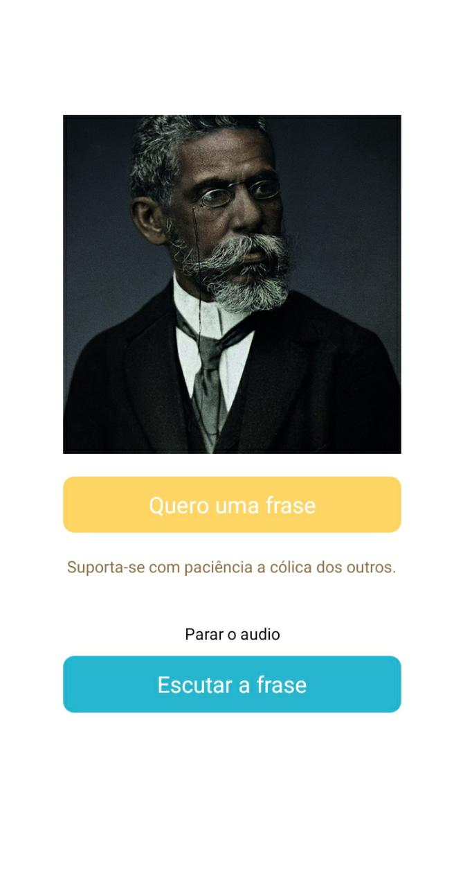

# Leitor de Frases

<p>
 Aplicativo desenvolvido com o intuito de colocar em pratica os conhecimentos em react native, com biblioteca expo e a expo Speech. Ele Gera uma frase de Machado de Assis então a pessoa pode escutar.
</p>

<br>

<h1>
  
</h1>

## 🧪 Tecnologias 

Esse projeto foi desenvolvido com as seguintes tecnologias:

- [React Native](https://reactnative.dev/)
- [Expo](https://expo.dev/)
- [Expo Speech](https://docs.expo.dev/versions/latest/sdk/speech/)

## Como executar 

Clone esse projeto e acesse a pasta

```bash
$ git clone https://github.com/alessandrordgs/leitor-de-frases.git
$ cd leitor-de-frases
```

Para iniciá-lo, siga os passos abaixo:
```bash
# Instalar as dependências
$ yarn
# Iniciar o projeto
$ expo start
```